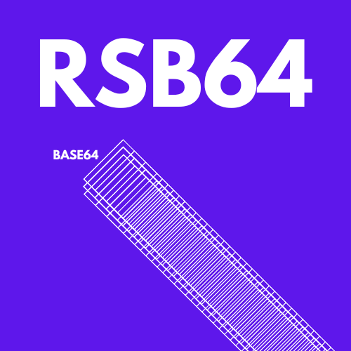

<p align="center"></p>

# `rsb64`

Base64 encoder and decoder written in Rust.


## Build
```
cargo build --bin rsb64 --release
```

Output binary file is available under `./target/release/rsb64`

## Run
In order to encode or decode, `rsb64` reads content from a file.

### Encode

```
./rsb64 file_name
```

### Decode
```
./rsb64 -decode file_name
```

## License
GPL2 for non-commercial use.

For license allowing usage in commercial projects, [please contact me via email](mailto:jedrzejpawel@maczan.pl).

## Author

Made in [Poland](https://en.wikipedia.org/wiki/Poland) in 2022 by [Jedrzej Pawel Maczan](https://maczan.pl/)